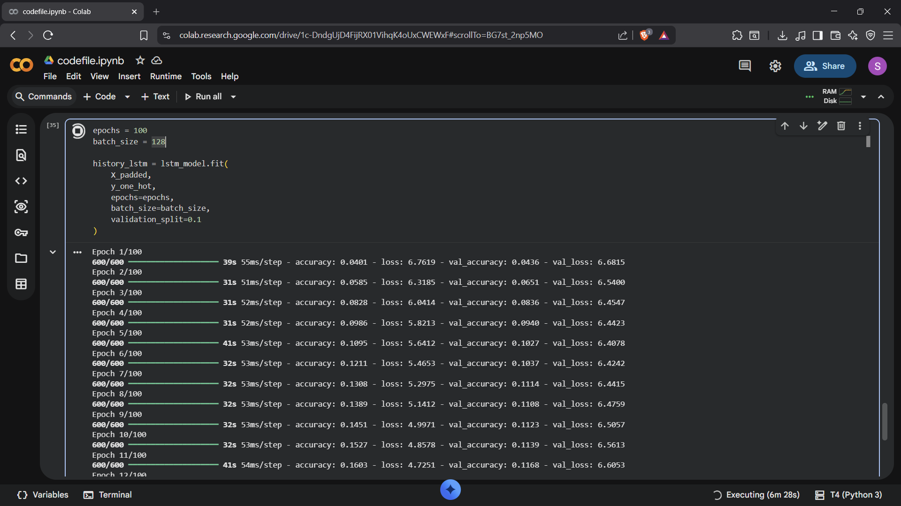
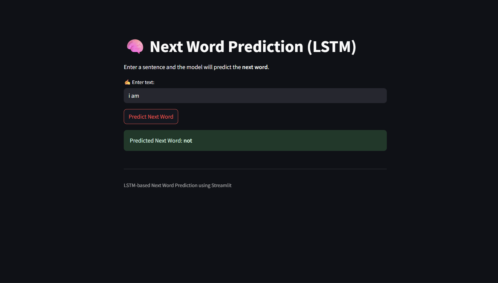

# 🧠 Next Word Prediction using RNN (LSTM)

🚀 A deep learning based web application that predicts the **next word** in a sentence using an LSTM (Recurrent Neural Network) model, built with Streamlit.

---

## 📌 Project Overview

This project uses a trained **LSTM model** to understand text sequences and predict the most probable next word based on user input.

✨ It demonstrates:
- Sequence modeling using RNN (LSTM)
- Natural Language Processing (NLP)
- Interactive UI with Streamlit

---

## 📸 Project Preview

<p align="center">
  
</p>

<p align="center">
  
</p>

<p align="center">
  
</p>

---

## 🎯 Features

✅ Predict next word in a sentence  
✅ Clean and interactive UI  
✅ Fast predictions using trained model  
✅ Handles unknown inputs gracefully  

---

## 🛠️ Tech Stack

- 🐍 Python  
- 🤖 TensorFlow / Keras  
- 📊 NumPy  
- 🎨 Streamlit  

---

## 📂 Project Structure
    RNN_Next_Word_Prediction-Project/
    │
    ├── app.py # Streamlit app
    ├── lstm_model.h5 # Trained LSTM model
    ├── tokenizer.pkl # Tokenizer
    ├── max_len.pkl # Max sequence length
    ├── requirements.txt # Dependencies
    └── README.md # Documentation
    
---

## ⚙️ Installation & Setup

### 🔹 Step 1: Clone the Repository
    ```bash
    git clone https://github.com/Sahil-Shrivas/RNN_Next_Word_Prediction-Project.git
    cd RNN_Next_Word_Prediction-Project

### 🔹 Step 2: Install Dependencies
    ```bash
    pip install -r requirements.txt
    pip install streamlit tensorflow numpy

### 🔹 Step 3: Run the Application
    ```bash
    streamlit run app.py

---

## ⭐ Support

If you found this project helpful, give it a ⭐ on GitHub!
